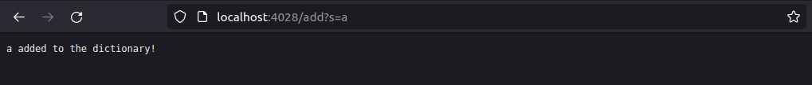

# CSE 15L Week 3 Lab Report

In this lab report we will be discussing both my simple search engine I developed in lab during week 2 as well as some of the bugs I encountered in week 3. For the first part, scroll down normally, for the second part, click [here](#Part-2:-Finding-and-Rewriting-Bugs).

## Part 1: Simple Search Engine

For the first part of this report I will be talking about the simple search engine I developed last week. The goal of this program is to run a server that you can add entries into then retrieve using a simple search command. Here is my code:

```
import java.io.IOException;
import java.net.URI;
import java.util.ArrayList;

class Handler implements URLHandler {
    // The one bit of state on the server: a number that will be manipulated by
    // various requests.
    ArrayList<String> dictionary = new ArrayList<String>();

    public String handleRequest(URI url) {
        if (url.getPath().equals("/")) {
            return String.format("Welcome to the search engine! There are currently %d items stored.", dictionary.size());
        } else if (url.getPath().contains("/add")) {
            String[] parameters = url.getQuery().split("=");

            if (parameters[0].equals("s")) {
                if (parameters.length == 1) {
                    return "Please specify a word to add!";
                }
                dictionary.add(parameters[1]);
                return String.format("%s added to the dictionary!", parameters[1]);
            }
        } else if (url.getPath().contains("/search")) {
            String[] parameters = url.getQuery().split("=");

            if (parameters[0].equals("s")) {
                String searchTerm = "";
                if (parameters.length != 1) {
                    searchTerm = parameters[1];
                }

                ArrayList<String> temp = new ArrayList<String>();
                for (int i = 0; i < dictionary.size(); i ++) {
                    if (dictionary.get(i).contains(searchTerm)) {
                        temp.add(dictionary.get(i));
                    }
                }
                return this.formatArrayList(temp);
            }
        }
        return "404 Not Found!";
    }

    public String formatArrayList(ArrayList array) {
        // Formats the search array for the Handler class into readable text.
        if (array.size() == 0) {
            return "No matches found!";
        }
        String str = "Matches: ";

        for (int i = 0; i < array.size(); i ++) {
            str += array.get(i);
            if (i < array.size() - 1) {
                str += ", ";
            }
        }

        return str;
    }
}

class SearchEngine {
    public static void main(String[] args) throws IOException {
        if(args.length == 0){
            System.out.println("Missing port number! Try any number between 1024 to 49151");
            return;
        }

        int port = Integer.parseInt(args[0]);

        Server.start(port, new Handler());
    }
}
```

Most of the structure of this program I shamelessly took from the NumberServer.java code. The part that I created was everything inside the Handler class. Let's see how it works when I run it on my localhost server.

Here is what the program looks like when you access the root URL. It outputs a message about how many items are currently stored in the engine.


For this to work, the server calls the `Handler.handleRequest()` method, which takes in a url. In this case, since the url path is the root, it prints out the message saying how many items are in the dictionary. The dictionary is an arrayList variable defined as soon as the server starts up.

Here is what the site looks like when you try to add a new item into the engine. In this case, we are adding the string "a".



Once again, for the Server is calling the `Handler.handleRequest()` method. However, since the path now has a query, it checks the query and goes into the if statement for when the query has the 'add' command. The dictionary is then updated with the new string and the text is displayed.

Now that we have inputted an item into the dictionary, we can use the search function to try and retrieve it. We'll be searching for any strings that contain the substring "a".


Here we get the second to last result of the `Handler.handleRequest()` method, which checks for the 'search' command. Since "a" is in the dictionary and we search for, it adds it to the `temp` arrayList of all the matching search terms. The program then calls the `formatArrayList()` method to format all of the search successes in `temp` into a string and then it prints it out on the page.

Finally, to get the last unique result of the server, we can search for a term that isn't in the dictionary. That can be seen below:


In this case, `Handler.handleRequest()` knows that the search command is used, but the search term doesn't meet any term in the dictionary, so instead of going through the normal `formatArrayList` process, it instead prints the output seen above.

## Part 2: Finding and Rewriting Bugs
## Finishing Up

Thanks for reading this guide! Check out some of my other lab reports on this page!