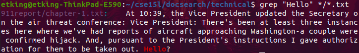

# CSE 15L Week 5 Lab Report

In this lab report we will be discussing the grep command and three different options that alter the grep command.

## A Look at the `grep` command

The grep command is used to search a file or multiple files for a specific pattern. Here is a usage without any modifications for the word "Hello" in every txt file in the technical folder.



As we can see, it prints the full line that matches the search term (as well as the file it came from since we are searching multiple files)

Now let's take a look at our first modification, the `-i` argument. This argument is fairly basic, it ignores case when searching for terms. When we use the same command as the example I gave above, except with the "hello" in lower case, we can see that this argument causes the same result to be printed, despite the case difference.

```
grep -i "hello" */*.txt

911report/chapter-1.txt:    At 10:39, the Vice President updated the Secretary on the air threat conference: Vice President: There's been at least three instances here where we've had reports of aircraft approaching Washington-a couple were confirmed hijack. And, pursuant to the President's instructions I gave authorization for them to be taken out. Hello?
```

This argument is very useful for when you want to search for a specific word without knowing the context it's used in. Without this argument, you could potentially exclude instances of the word being used at the beginning of sentences for example.
```
grep -i "searching" */*.txt

911report/chapter-11.txt:                to fix glaring vulnerabilities-expanding no-fly lists, searching passengers
911report/chapter-13.4.txt:            56. NSC memo, Clarke to Berger, "Post-Millennium Soul Searching," Jan. 11, 2000.
```
(Most of the output is excluded for this one, but the first two lines show the usage of `-i`)

Here's one last usage of `-i` where we search for "happiness."

```
grep -i "happiness" */*.txt

911report/chapter-11.txt:                other members of the JCS let the press know their unhappiness that, in conformity
plos/journal.pbio.0020067.txt:        happiness in newfound family life. Research gradually gave way to the pursuit of pacifist
plos/journal.pbio.0020116.txt:        Pursuit of Happiness” (http://bioethics.gov/reports/beyondtherapy/index.html) and
```

Now let's look at another modifier, the `-l` argument. This one only shows the filenames as opposed to the entire line where the search term shows up. Here's an example of this used on our original example:

```
grep -l "Hello" */*.txt

911report/chapter-1.txt
```

The output for grep suddenly becomes a lot cleaner when you are searching through a lot of different files. This is very useful for when you want to know what files contain a search term as opposed to where in each file the term is.

```
grep -l "destructive" */*.txt

911report/chapter-12.txt
911report/chapter-13.5.txt
biomed/1471-2180-2-22.txt
biomed/1471-2261-2-11.txt
biomed/ar409.txt
biomed/ar615.txt
biomed/cvm-2-1-038.txt
biomed/gb-2001-3-1-research0001.txt
biomed/gb-2003-4-5-r32.txt
plos/journal.pbio.0020054.txt
plos/journal.pbio.0020213.txt
plos/journal.pbio.0020307.txt
plos/pmed.0020033.txt
```

Do note however that all of the examples so far are looking through every file in the `technical` directory. This argument becomes a lot less useful when looking through only a few files. But for a case like this where we are looking through 1391 different txt files, it works wonderfully.

```
grep -l "unitary" */*.txt

biomed/1471-2202-3-4.txt
plos/pmed.0020247.txt
```

Our final option we will be looking at is `-n`, which prints out the line number that the search term was found at alongside everything else. Here is our original search with `-n`.

```
grep -n "Hello" */*.txt

911report/chapter-1.txt:682:    At 10:39, the Vice President updated the Secretary on the air threat conference: Vice President: There's been at least three instances here where we've had reports of aircraft approaching Washington-a couple were confirmed hijack. And, pursuant to the President's instructions I gave authorization for them to be taken out. Hello?
```

This can be a very useful option if you have large files and you want to know where exactly the insance of the search term is.

```
grep -n "happiness" */*.txt

911report/chapter-11.txt:516:                other members of the JCS let the press know their unhappiness that, in conformity
plos/journal.pbio.0020067.txt:123:        happiness in newfound family life. Research gradually gave way to the pursuit of pacifist
plos/journal.pbio.0030105.txt:28:        happiness, sadness, or anger, gave the audience insight into the variety of subtle
plos/pmed.0010052.txt:141:        support his unhappiness? Not many, and the arguments that he does offer miss the point
```

This does add more to the output, so it can be messy if you are searching through very large amounts of files.

```
grep -n "hopeless" */*.txt

911report/chapter-13.5.txt:2862:                of hopelessness among the Muslim countries and their people. They feel that they can
911report/chapter-3.txt:988:                seemed, and ultimately proved, to be a hopeless effort to persuade the Taliban
biomed/1472-684X-1-5.txt:406:          and hopelessness are inevitable and permanent
biomed/1472-684X-1-5.txt:418:          feelings of helplessness, hopelessness, and
```

This concludes our look at the grep command and the `-i`, `-l`, and `-n` options.

## Finishing Up

Thanks for reading this guide! Check out some of my other lab reports on this page!