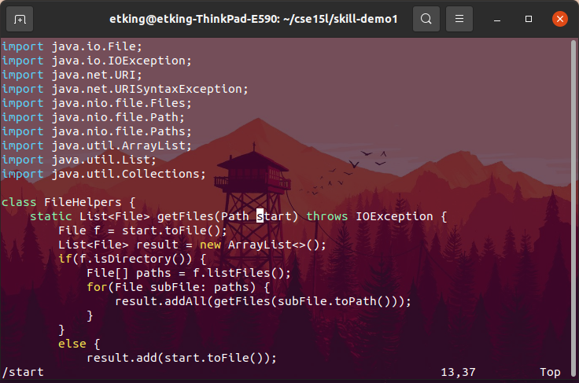

# CSE 15L Week 7 Lab Report

In this lab report we will be discussing several things related to optimization and vim. Let's get started!

## Part 1: Streamlining vim

As a part of lab in week 6, I worked with my team to optimize several tasks within vim. Here, I am going to share our best solution for one of these tasks: refactoring `DocSearchServer.java` to use the variable `base` instead of `start`. Our final command sequence is shown here:

```
/start<enter>cebase<esc>n.n.:wq<enter>
```

To make this easier to understand, let's break it down into parts. Here is what vim looks like when we open up the file.


Now, let's type in our first 7 keys, `/start<enter>`



This searches for the word "start" and the enter key press takes us to the first instance of that word, which is the first one we want to change.

Now, let's type in next 6 keys, `cebase`


This deletes the word that we are currently on (start), and then enters insert mode and types in the new word we want to replace the old one with (base).

Now, let's type in next 5 keys, `<esc>n.n.`


This escapes from insert mode and goes to the next instance of our search (the next place where "start" appears). Then, the `.` repeats our previous command, which replaces "start" with "base". We repeat this one more time because there are three total instances of "start" that need replacement.

Now, let's type in last 4 keys, `:wq<enter>`

There's no need to show a screenshot for this step since it just saves our work and exits from the vim buffer.

This command sequence in total is 22 keystrokes, which is pretty respectable for refactoring a variable name.

## Part 2: To vim or not to vim

In this part I have been asked to compare the workflow of using VSCode and `scp` to make changes to a remote file versus using `ssh` and vim. After attempting to optimize both methods, I found I was able to make a minor (couple lines) change and test it in about 25 seconds with the first method and about 20 seconds with the second method. If I have the terminal commands saved then I really don't run into any issues with either method.

In terms of preference, I prefer using the second method (vim on the remote) simply because it involves less terminal commands overall. I don't find vim to be that much harder to work with than an IDE like VSCode, so I would rather just work fully on the remote rather than transferring files constantly. I don't think there are any factors that would make me specifically want to use VSCode for something like this more, since having a large project with more files would only make constantly transferring those files harder. Additionally, I kinda like using vim as a text editor. It's really simple and not overcomplicated, so I like working in it, and I don't really see it as a major negative if I have to work using it.

## Finishing Up

Thanks for reading this guide! Check out some of my other lab reports on this page!