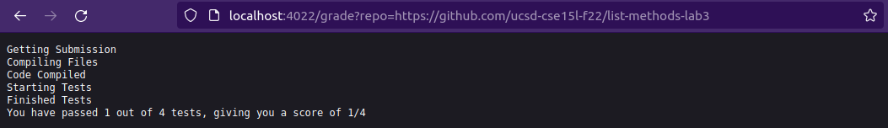
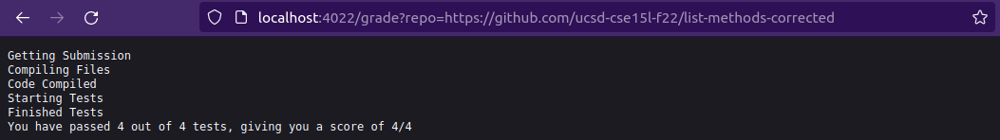
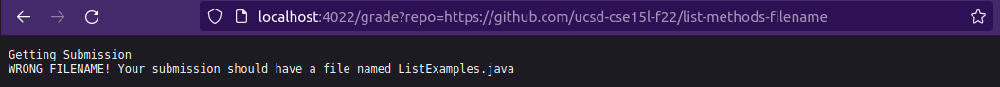

# CSE 15L Week 7 Lab Report

In this lab report we will be discussing the automatic grading script I created.

## The Grading Script

To start off, I'm going to show the entire grading script in a code block here:

```
# Create your grading script here

CP=".:../lib/hamcrest-core-1.3.jar:../lib/junit-4.13.2.jar"

echo "Getting Submission"
rm -rf student-submission
git clone $1 student-submission 2> /dev/null
cp TestListExamples.java student-submission/
cd student-submission/

# Checking if the submission has the file we are using. If not, exit and give an error message
if [ -f "ListExamples.java" ]; then
	echo "Compiling Files"
else
	echo "WRONG FILENAME! Your submission should have a file named ListExamples.java"
	exit
fi

javac -cp $CP *.java 2> compiler_output.txt

# Checking if there are any compiling errors
if [ $? -eq "0" ]; then
       echo "Code Compiled"	
else
	echo "ERROR COMPILING! See error message below for more details"
	cat compiler_output.txt
	exit
fi

echo "Starting Tests"
java -cp $CP org.junit.runner.JUnitCore TestListExamples > test_output.txt
echo "Finished Tests"

# TNUM is the number of total tests, and ENUM is the number of failed tests
awk -F\. '{print NF-1}' test_output.txt > temp.txt
TNUM=$(sed -e '1d;3,$d' temp.txt)
awk -F\E '{print NF-1}' test_output.txt > temp.txt
ENUM=$(sed -e '1d;3,$d' temp.txt)

# PNUM takes the number of passed tests
```

When this script is run on a server, this is what it produces:

Implementation 1: https://github.com/ucsd-cse15l-f22/list-methods-lab3



Implementation 2: https://github.com/ucsd-cse15l-f22/list-methods-corrected



Implementation 3: https://github.com/ucsd-cse15l-f22/list-methods-filename



Let's go further into the first implementation. In order to understand how the script works, we'll go line by line and see what each line adds to the stdout and stderr when running on the first implementation. Additionally, for some of the not self-explanatory lines, I'll provide explanation of what it's doing.

`CP=".:../lib/hamcrest-core-1.3.jar:../lib/junit-4.13.2.jar"`

Does not add anything to stdout or stderr. Exit Code: 0

`echo "Getting Submission"`

Adds "Getting Submission" to stdout. Exit Code: 0

`rm -rf student-submission`

Does not add anything to stdout or stderr. Exit Code: 0

`git clone $1 student-submission 2> /dev/null`

Does not add anything to stdout or stderr. However, git clone usually outputs a bunch of text. The reason it doesn't here is because I'm routing all the github text to /dev/null, which effectively deletes it. I just didn't like the github output cluttering up my script's output. Exit Code: 0

`cp TestListExamples.java student-submission/`

Does not add anything to stdout or stderr. Exit Code: 0

`cd student-submission/`

Does not add anything to stdout or stderr. Exit Code: 0

`if [ -f "ListExamples.java" ]; then`

Since ListExamples.java exists in this example, the code after this if statement runs.

`echo "Compiling Files"`

Adds "Compiling Files" to stdout. Exit Code: 0

`echo "WRONG FILENAME! Your submission should have a file named ListExamples.java"`

`exit`

These two lines never run because the if statement succeeded.

`javac -cp $CP *.java 2> compiler_output.txt`

Does not add anything to stdout or stderr. Exit Code: 0

`if [ $? -eq "0" ]; then`

Since the exit code of the previous command is zero, the code directly after this if statement runs.

`echo "Code Compiled"`

Adds "Code Compiled" to stdout. Exit Code: 0

`echo "ERROR COMPILING! See error message below for more details"`

`cat compiler_output.txt`

`exit`

These three lines never run because the if statement succeeded.

`echo "Starting Tests"`

Adds "Starting Tests" to stdout. Exit Code: 0

`java -cp $CP org.junit.runner.JUnitCore TestListExamples > test_output.txt`

Does not add anything to stdout or stderr. Exit Code: 0

`echo "Finished Tests"`

Adds "Finished Tests" to stdout. Exit Code: 0

`awk -F\. '{print NF-1}' test_output.txt > temp.txt`

Does not add anything to stdout or stderr. This line and the next few lines are fairly confusing, so I'll explain them here. This line and the next one are checking how many dots there are in the output from the JUnit test and assigning that number to a variable. This is the number of tests run. The next two lines are a repeat of these two lines, except with "E" instead, counting how many errors there are. Exit Code: 0

`TNUM=$(sed -e '1d;3,$d' temp.txt)`

Does not add anything to stdout or stderr. Exit Code: 0

`awk -F\E '{print NF-1}' test_output.txt > temp.txt`

Does not add anything to stdout or stderr. Exit Code: 0

`ENUM=$(sed -e '1d;3,$d' temp.txt)`

Does not add anything to stdout or stderr. Exit Code: 0

`PNUM=$(($TNUM - $ENUM))`

Does not add anything to stdout or stderr. PNUM is defined as the number of tests passed by the implementation. In this case, there are 3 errored tests out of 4 total, so $PNUM is 1. Exit Code: 0

`echo "You have passed $PNUM out of $TNUM tests, giving you a score of $PNUM/$TNUM"`

Adds "You have passed 1 out of 4 tests, giving you a score of 1/4" to stdout. Exit Code: 0

That's all of the lines of the grading script. Note that all normal output is supressed and every output of the grading script is created artificially through `echo` commands.

Hopefully this little walkthrough helped your understanding of my grading script.

## Finishing Up

Thanks for reading this guide! Check out some of my other lab reports on this page!